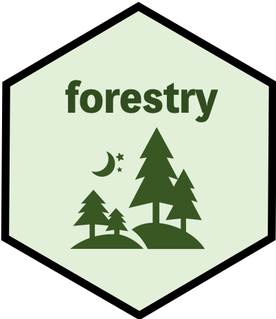

class: left, middle


```{r setup, include=FALSE}
options(htmltools.dir.version = FALSE)
```
## Why nested (hierarchical) data?


.footnote[
[1] Jiena McLellan (2020). forestry: Reshape Data Tree. R package version 0.1.0.
  https://CRAN.R-project.org/package=forestry
]

--
### When building htmlwidgets, facing nested structure JSON

--
### When Tree-like structures are already used in R: in machine learning (e.g. classification trees)

---
class: left, middle

## Unlock R's potential with nested data


.footnote[
[1] Jiena McLellan (2020). forestry: Reshape Data Tree. R package version 0.1.0.
  https://CRAN.R-project.org/package=forestry
]

--
### Current R packages (`jsonlite` and `rjson`) to convert a tabular R data to a JSNO data

--
### Yet, there is a need to introduce more tools to reshape an R data to a nested JSON structure


---
class: center, middle

# Get Started


---
class:  left, top

### Use Case:

#### Create an JSON array from tree

```{r out.width='100%', fig.height = 4, eval = require('forestry')}
library(forestry)
new_node <- create_nodes(tree_name = "tree1", 
                         add_children_count = 3, 
                         class = c("A", "B", "C") )
print(new_node, "class")
library(htmlwidgets)
htmlwidgets:::toJSON(forestry::pre_get_array(as.list(new_node)) )
```

---
class: left, top

#### Use case: Monthly and quarterly cum sum of exercise time

```{r  out.height='100%', eval = require( 'forestry', 'data.tree')}
exercise_node <- data.tree::as.Node(exercise_df)
exercise_node$Do(function(node) node$exercise_time <- data.tree::Aggregate(node, attribute = "exercise_time", aggFun = sum), traversal = "post-order")
print(exercise_node,  "exercise_time")
```

---
class:  left, top

#### Continued Use Case:

```{r  out.width='100%',  eval = require( 'forestry', 'data.tree')}
exercise_node_test <- cumsum_across_level(input_node = exercise_node, attri_name = "exercise_time", level_num = "All")
print(exercise_node_test,"exercise_time", "cumsum_number", "level")
```

---
class:  left, top

#### To be continued

